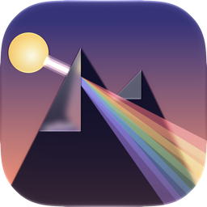
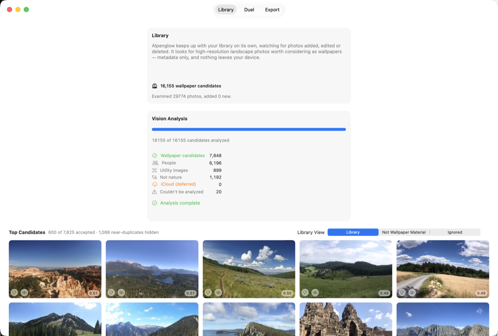
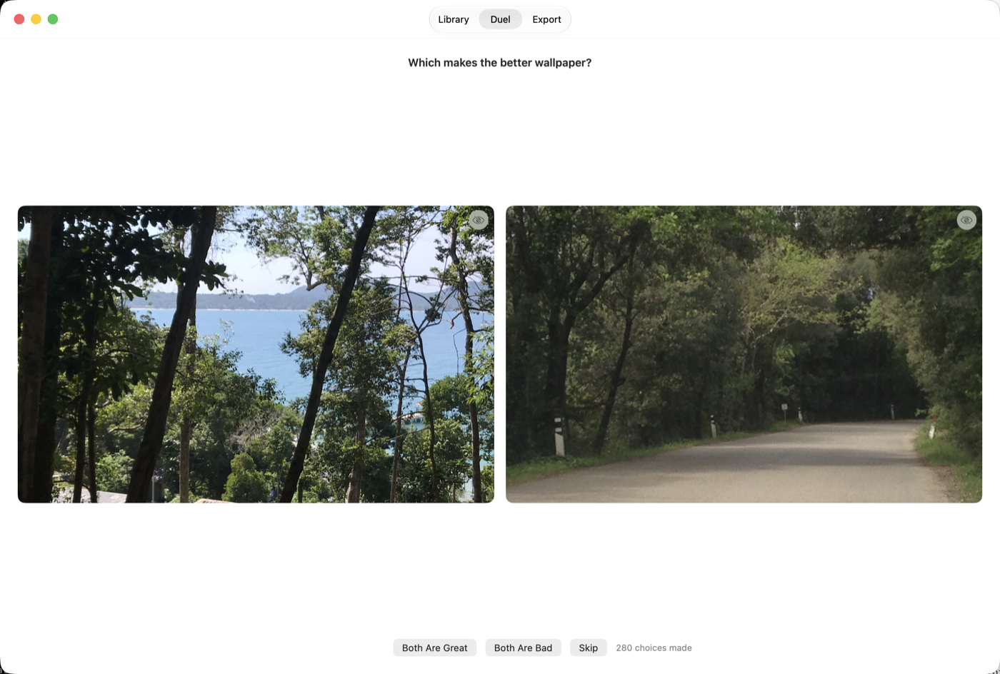
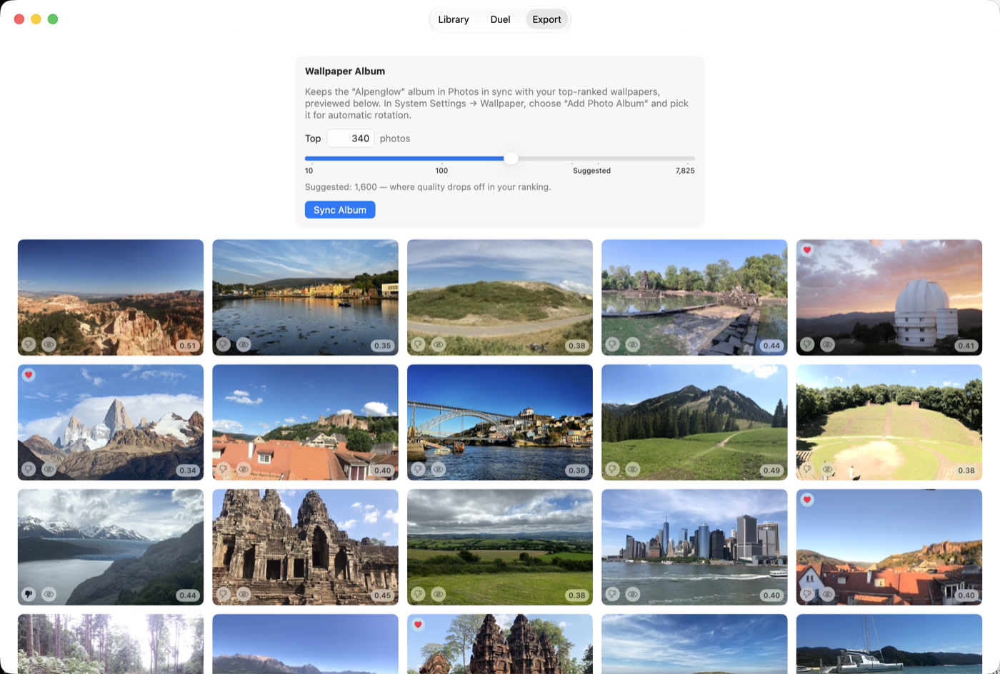

# Firnlight



Firnlight curates desktop wallpapers from your own Photos library. It finds
high-resolution nature photos without people, learns your taste from quick
pairwise duels, and maintains a Photos album — "Firnlight" — that System
Settings can rotate as your wallpaper. Everything runs on-device.

It runs on macOS 27+ and, as a companion, on iPhone and iPad on iOS 27+ —
except that the current download, 0.15.0, is the last release that still
runs on macOS 26 and iOS 26. The Mac
is the only place wallpaper actually gets set; on iPhone and iPad, Firnlight
finds, learns, and curates into the same album, which syncs to the Mac.

[](docs/store/library.png)

*Firnlight keeps up with your library on its own — nothing to scan, nothing
to manage — and ranks what it finds.*

[](docs/store/duel.png)

*You shape the ranking two photos at a time: whichever makes the better
wallpaper.*

[](docs/store/export.png)

*Your top picks land in a Photos album System Settings can rotate for you.*

Screens as of v0.14.1.

See [REQUIREMENTS.md](REQUIREMENTS.md) for exactly what the app does and why.

## Status

Firnlight is pre-1.0 (see [CHANGELOG.md](CHANGELOG.md) for the current
version) and under active development. Some behaviors are documented as
verified only on specific hardware — see the doc comments at the relevant
call sites for details.

## Installation

Download the latest build from
[Releases](../../releases). There's no App Store distribution and no build
step required.

Because this build isn't signed with a paid Apple Developer account,
Gatekeeper will refuse to open it on first launch ("Apple cannot check it for
malicious software"). To clear that:

- Right-click (or Control-click) the app in Finder and choose **Open**, then
  confirm in the dialog that appears — this only needs to be done once, or
- Run `xattr -cr Firnlight.app` in Terminal before opening it.

## Usage

Launch the app and grant Photos access when prompted. The three tabs mirror
the pipeline:

1. **Library** — keeps up with your Photos library on its own, finding
   wallpaper candidates and ranking them. There is nothing to press: it
   catches up when it opens and follows changes as they happen.
2. **Duel** — shows you two photos at a time and learns your taste from
   which one you pick.
3. **Export** — maintains the "Firnlight" Photos album with your top-ranked
   photos. On the Mac, point System Settings → Wallpaper at that album to
   have it rotate automatically.

## Building from source

Requires the full Xcode 26+ toolchain (not just the Command Line Tools) —
Xcode 26 is what CI builds against; see [CLAUDE.md](CLAUDE.md) for why the
project still targets 26 while running on 27, and why its own development
machine runs a newer beta:

```bash
git clone --recurse-submodules <this-repo-url>
cd Firnlight
xcodebuild -project Firnlight.xcodeproj -scheme Firnlight -configuration Debug build
```

or just `open Firnlight.xcodeproj`. See [CLAUDE.md](CLAUDE.md) for the fuller
build, run, and debugging notes (icon rendering, log filtering, simulator
quirks, and so on).

Then arm the repository's pre-push check, which refuses to push anything
personal to your machine or accounts (REQUIREMENTS.md FR-10.4):

```bash
git config core.hooksPath .githooks
```

Git never runs hooks straight out of a clone, so this line is the opt-in — a
courtesy that catches a leak before it ever leaves your machine.
`scripts/check-no-personal-data.sh` is the check itself, and the "Personal
data check" GitHub Actions workflow is the actual guarantee: it runs that
same script on every push to every branch, whether or not you set the line
above, so nothing personal gets published even from a clone where it was
never run.

There is no test target — the app's thresholds are tuned by hand against a
real Photos library, and most of its functionality requires interactive
Photos authorization to exercise at all.

## Support

Found a bug or have a feature request? Open an issue on this repository.

## Authors and acknowledgment

Built by [remco.space](https://remco.space). Developed with Claude Code —
see the commit history for co-authorship attribution.

## License

MIT — see [LICENSE](LICENSE). A few Claude Code skill files under
`.claude/skills/` are third-party; see
[THIRD_PARTY_NOTICES.md](THIRD_PARTY_NOTICES.md).
